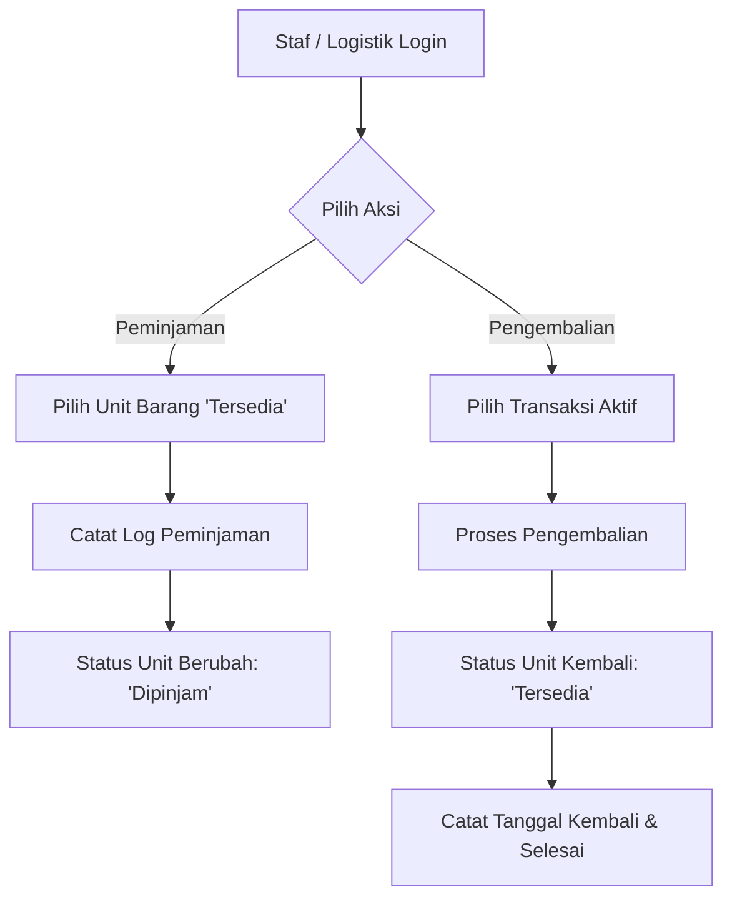
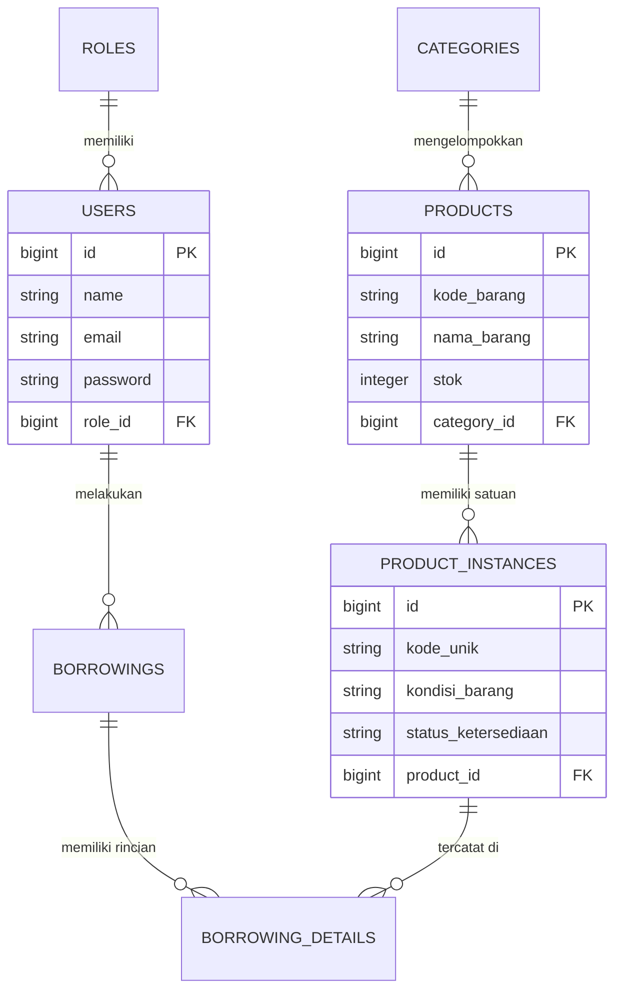
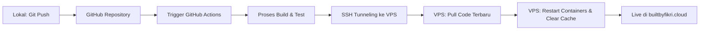

# INVENTSEL - Sistem Manajemen Inventaris

INVENTSEL adalah aplikasi manajemen inventaris berbasis web yang dirancang khusus untuk mengelola, melacak, dan memonitor aset logistik seperti perangkat multimedia, alat IT, fasilitas kantor, dan perkakas teknik. Aplikasi ini mengadopsi arsitektur modern berbasis kontainer untuk menjamin keandalan dan skalabilitas sistem di lingkungan produksi.

## Fitur Utama
Manajemen Katalog & Instansiasi Barang: Pemisahan antara master data template produk dengan unit spesifik (serial number/kode unik) beserta pelacakan kondisi barang (Baik, Rusak Ringan, Rusak Berat).

- Log Peminjaman & Pengembalian Otomatis: Pencatatan otomatis transaksi peminjaman barang terintegrasi dengan pembaruan status ketersediaan unit secara real-time.
- Dashboard Statistik Bulanan Dinamis: Grafik peminjaman bulanan yang dibangun secara dinamis dan adaptif terhadap multi-database engine.
- Ekspor Laporan Fleksibel: Mendukung pengunduhan data riwayat logistik dalam format Excel (.xlsx) dan PDF (.pdf).
- Peningkatan Keamanan Produksi: Menonaktifkan fitur registrasi akun publik (/register) guna menghindari pendaftaran akun tidak sah oleh pihak luar.

## Application Flow (Alur Aplikasi)
Berikut adalah gambaran alur logika proses peminjaman dan pengembalian unit barang di dalam sistem INVENTSEL:



## Database Schema & ERD
Sistem ini menggunakan relasi database yang memisahkan entitas pengguna (User), peran (Role), kategori (Category), template produk (Product), dan satuan instansi (Product Instance) untuk mendukung pencatatan riwayat peminjaman (Borrowing) yang mendetail.



## DevOps & Arsitektur Infrastruktur
Aplikasi didistribusikan menggunakan Docker Compose dalam lingkungan terisolasi (Bridge Network) untuk memisahkan tanggung jawab antara web server, core application, dan database.

## Spesifikasi Tech Stack
- Backend Framework: Laravel 11 (PHP 8.x)
- Web Server: Nginx (Alpine Image)
- Database Engine: PostgreSQL 15 (Environment Produksi) / MySQL (Environment Lokal)
- Frontend Compiler: Vite & Tailwind CSS

## Arsitektur Jaringan Kontainer
```
[ Jagat Internet ] 
       │ (HTTPS - Port 443 / HTTP - Port 80)
       ▼
┌──────────────────────────────────────── VPS Ubuntu Host ────────────────────────────────────────┐
│                                                                                                 │
│  ┌────────────────────────────── Docker Compose Network (Bridge) ────────────────────────────┐  │
│  │                                                                                           │  │
│  │  [ inventsel-webserver (Nginx:alpine) ] ───► Membaca SSL dari /etc/letsencrypt (Host)      │  │
│  │               │                                                                           │  │
│  │               ▼ (FastCGI Pass - Port 9000)                                                │  │
│  │  [ inventsel-app (Laravel 11) ]                                                           │  │
│  │               │                                                                           │  │
│  │               ▼ (PostgreSQL Port 5432)                                                    │  │
│  │  [ inventsel-db (PostgreSQL 15) ] ───► Volume Terisolasi (inventsel-db-data)              │  │
│  │                                                                                           │  │
│  └───────────────────────────────────────────────────────────────────────────────────────────┘  │
└─────────────────────────────────────────────────────────────────────────────────────────────────┘
```

## CI/CD Pipeline (Automated Deployment)
Proses pembaruan fitur dan perbaikan kode berjalan secara otomatis dari lokal hingga server produksi menggunakan GitHub Actions.



## Panduan Instalasi Lokal
Jika Anda ingin menjalankan proyek ini untuk kebutuhan pengembangan (development) di komputer lokal, ikuti langkah-langkah berikut:

### 1. Clone Repositori:

```Bash
git clone https://github.com/username/inventsel.git
cd inventsel
```

### 2. Salin Environment File:

```Bash
cp .env.example .env
Sesuaikan pengaturan DB_CONNECTION=mysql dan sesuaikan nama database serta password untuk environment lokal Anda.
```

### 3. Jalankan Kontainer Docker:

```Bash
docker-compose up -d
```

### 4. Instal Dependensi & Generate Key:

```Bash
docker-compose exec app composer install
docker-compose exec app npm install
docker-compose exec app npm run build
docker-compose exec app php artisan key:generate
```

### 5. Jalankan Migrasi dan Sinkronisasi Data (Seeder):
```Bash
docker-compose exec app php artisan migrate:fresh --seed
```

## Akun Login Pengujian (Testing Accounts)

Setelah database berhasil dimigrasikan dan diisi menggunakan perintah *seeder*, Anda dapat menggunakan akun-akun bawaan berikut untuk menguji fungsionalitas hak akses (*Role-Based Access Control*) pada halaman login:

| Role / Hak Akses | Alamat Email | Kata Sandi (Password) |
| :--- | :--- | :--- |
| **Super Admin** | `admin@inventsel.com` | `password` |
| **Staf Gudang / Logistik** | `staff@inventsel.com` | `password` |
| **Manajer** | `manager@inventsel.com` | `password` |

*(Catatan: Segera hapus atau ubah kredensial default ini sebelum menaikkan kode ke repositori atau lingkungan produksi publik).*
